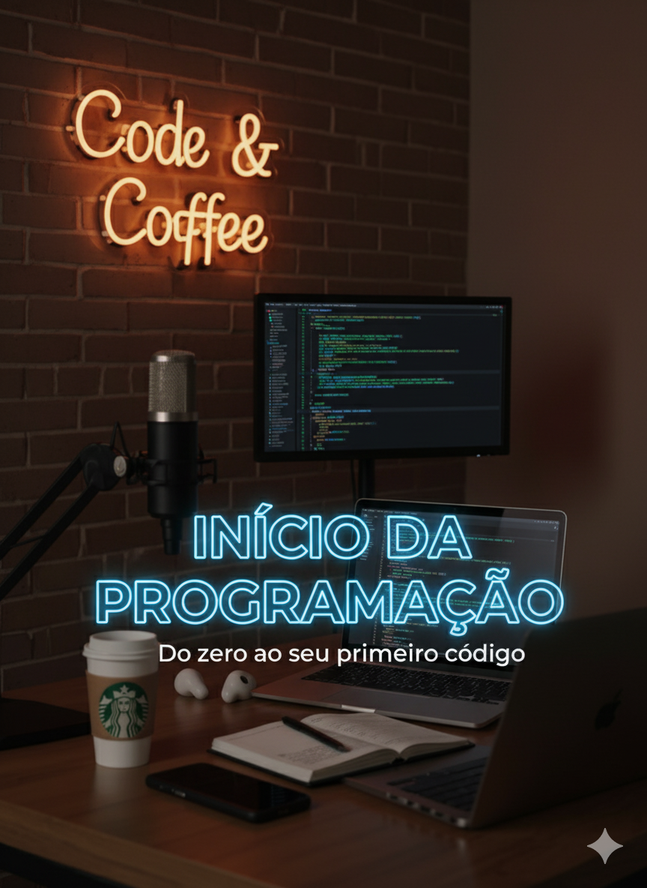

## ☕ Code & Coffee: Da Lógica à Carreira com IAs Generativas

  
  
  

  

O desenvolvimento de conteúdo moderno não exige mais um estúdio completo. **Ele exige fluência no uso de ferramentas digitais e iniciativa.**

Este projeto é a entrega da atividade **"Criando um Podcast com IAs Generativas"** da **DIO.me**, mas foi totalmente desenvolvido e batizado por mim. O meu objetivo foi **ir além da proposta original** (que utilizava dublagem simples) para criar um produto multimídia completo: um podcast com áudio e vídeo animado.

O resultado é um conteúdo de **16 minutos e 9 segundos** do meu podcast **Code & Coffee**, focado em transformar a **Lógica de Programação** em um guia acessível.

---

### 💡 Destaques do Conteúdo (Episódio #1: Início da Programação)

O meu episódio foca em estabelecer a base sólida que todo desenvolvedor precisa, desmistificando a área e reforçando a mentalidade de crescimento.

#### 1. O Alicerce: Lógica, Dados e Controle

O estudo completo, detalhado no Notion, explora os fundamentos que separam um iniciante de um programador eficiente:

| Conceito | Foco Principal | Valor Profissional |
| :--- | :--- | :--- |
| **Algoritmos** | A sequência ordenada de passos (a **"Receita de Bolo"**). | Habilitar o planejamento do código (**Pseudocódigo**) antes de ir para o teclado, evitando códigos confusos. |
| **Estruturas** | O uso de **Seleção (IF/ELSE)** e **Repetição (FOR/WHILE)**. | Dominar os pilares que dão **inteligência** e **automação** ao software. |
| **Mentalidade** | Erros Comuns e Persistência. | Entender que errar não é falha, mas sim o **método de aprendizado** (Debugging). |

#### 2. Minha Metodologia: Superando a Proposta com Vídeo e Áudio

Esta seção detalha o meu *pipeline* de produção, que inovou ao adicionar a camada de vídeo e imagens animadas (personagens virtuais "Mi" e "Matheo") ao projeto:

| Ferramenta | Etapa de Produção | Uso Estratégico na Atividade |
| :--- | :--- | :--- |
| **[NotebookLM](https://notebooklm.google.com/)** | Geração do Roteiro | **Curadoria de Conteúdo e Estrutura** do roteiro de 16 minutos a partir das fontes. |
| **[Meta.AI](https://www.meta.ai/)** | Criação Visual | **Geração e Animação das Imagens** dos meus apresentadores virtuais. |
| **[DreamFace App](https://dreamfaceapp.com/)** | Humanização | **Sincronização Labial** para dar realismo à fala dos personagens (meu diferencial em relação à dublagem simples). |
| **[CapCut](https://www.capcut.com/) / [MP3 Cut.net](https://mp3cut.net/)** | Edição Final | **Montagem e Corte Fino do Áudio/Vídeo**, garantindo a precisão da entrega (16:09). |

---

### 🔗 Acesso ao Conteúdo Completo

Se você está começando a programar ou deseja ver como a IA pode acelerar sua produção de conteúdo, este projeto é um guia essencial.

➡️ **[Acesse o Guia de Estudos no Notion aqui!](https://impossible-song-21a.notion.site/Code-Coffee-2772a0c5255080d0a7b3e8ca1cc89f9d?source=copy_link)**
 
➡️ **[Ouça ao Podcast (16:09) aqui!](assets/audio/Início%20da%20Programação.mp4)**
➡️ **[Assista ao Podcast (16:09) aqui!](assets/VideoPodcast/Início%20da%20Programação.mp4)**
---

  
  
<i>Apresentadores Virtuais: O resultado da minha produção digital.</i>

---

**Desenvolvido por: [Mirella Wanessa]** | **Projeto Acadêmico: DIO.me (Aprofundamento)**

---

## 🤝 Conecte-se comigo

Vamos trocar ideias sobre IA, produção e a jornada DEV!

  

